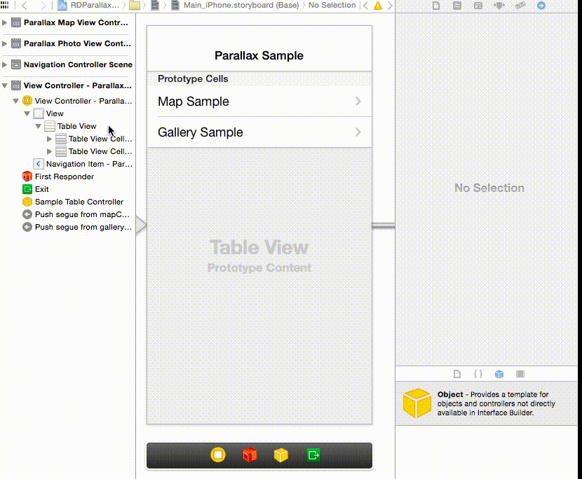

# RDParallaxController  #

- Add a parallax top view to any UIScrollView
- Inspired by apps like foursquare or path

## Features ##

<ul>
<li>Easy configuring right from interface builder. No code required!</li>
<li>Supports any UIScrollView</li>
<li>Use any UIView for the top view</li>
<li>Rich delegation methods for:<ul>
	<li>Top view tap</li>
	<li>Pan over boundary</li>
	<li>Full size top view</li>
	<li>Scroll states</li>
</ul></li>
<li>Uses plain views that already exist in your UIViewController</li>
<li>Keep contol of your UIScrollView delegate</li>
<li>Works with Storyboards</li>
<li>Developed for iOS7 (but should by compatible to iOS 5 - but not tested)</li>
</ul>

## Configuring ##

## Contributing ##

Most annoying issue is #1, current workaround causes some blinks when popping view controller. I would appreciate if you find a good solution.

## More Parallax Views ##

- [QMBParallaxScrollViewController](https://github.com/quemb/QMBParallaxScrollViewController) — this was original parallax controller, mine derivative does not requires viewControllers for top and bottom view and easier to configure from storyboard
- [M6ParallaxController](https://github.com/xelvenone/M6ParallaxController)
- [A3ParallaxScrollView](https://github.com/allaboutapps/A3ParallaxScrollView)
- [MDCParallaxVie](https://github.com/modocache/MDCParallaxView)
